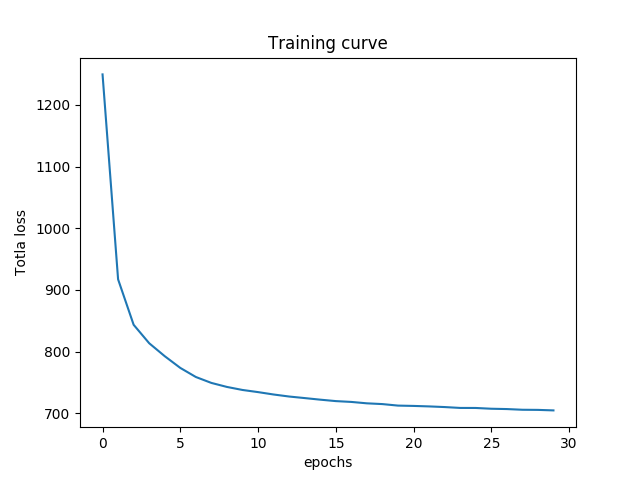

# Homework 3 for Deep Learning

## Environment

* ubuntu 16.04 LTS
* python3.5.2
* tensorflow 1.4.1
* GPU: Tesla P100

### Variational Autoencoder

In this task, I used convolution layers to construct [VAE](https://arxiv.org/pdf/1312.6114.pdf), 
and trained it with L2 loss on an anime character faces dataset (> 50000 of 96x96 samples) provide by the course TA.
I think it was collected using the procedure described [here](https://github.com/jayleicn/animeGAN).

    $ python3 train_VAE.py

After training, the model will plot the training loss curve and some examples before encoded and after decoded, to compare the differences; 
it will also generate some random images by sampling the latent space distribution.

### Generative Adversarial Network

I construct a regular diabolo shaped GAN network, and trained it on the same dataset with some augmentation.
[train_DCGAN](train_DCGAN.py) used traditional GAN objective function, while [train_LSGAN](train_LSGAN.py) used L2 loss 
as objective function described [here](https://arxiv.org/pdf/1611.04076v3.pdf). 
By testing it seems like LSGAN is more robust.

The model will continually plot some generated images with fixed noise while training, and plot the learning curve 
of generator and discriminator after training.

    $ python3 train_DCGAN.py
    $ python3 train_LSGAN.py

Training curve of DCGAN:

Training curve of LSGAN:

### Things I have learned

1. To find the balanced of discriminator and generator is hard. I ended up adding dropout layers in discriminator, 
gaussian noise on all the images (including faked samples), and update generator twice every iterations, so that the performance 
of discriminator can be suppress.
2. Batch normalization maybe be helpful to accelerate training, but it also make the generator harder to compete 
with the discriminator. Besides, I personally don't like the images produced with batch normalization = =.
3. Adam optimizer also good to accelerate the process, but same reason, the image looks a little weird.